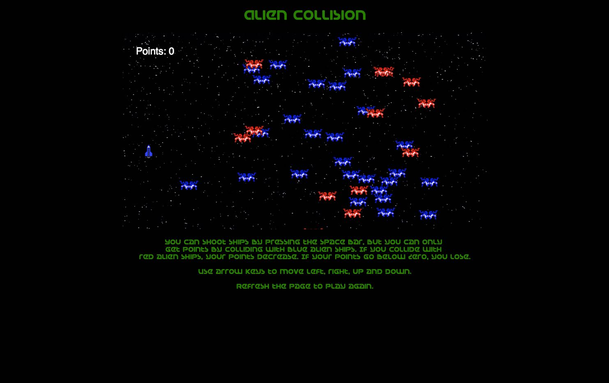

# Alien Collision

A simple game with inspiration taken from the arcade classic, Space Invaders, with a twist.

## How to Play
You can shoot ships by pressing the space bar, but you can only
get points by colliding with blue alien ships. If you collide with
red alien ships, your points decrease. If your points go below zero, you lose.

Use arrow keys to move left, right, up and down.

## Technologies Used
- JavaScript
- Canvas API

## Potential future features
- Sound
- Image sprites
- Mute button
